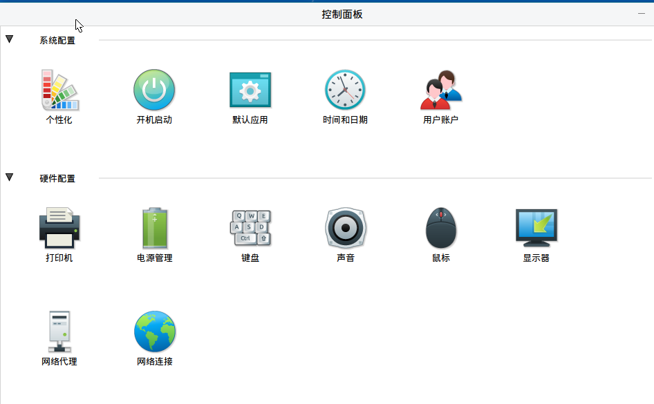
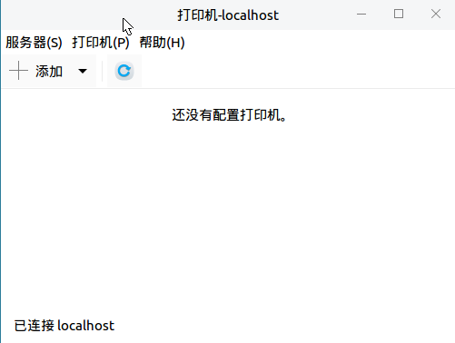
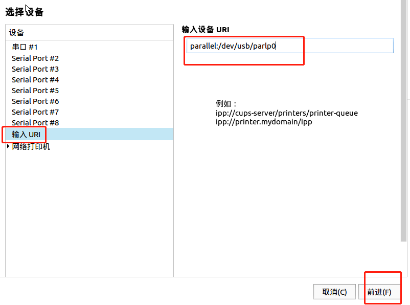
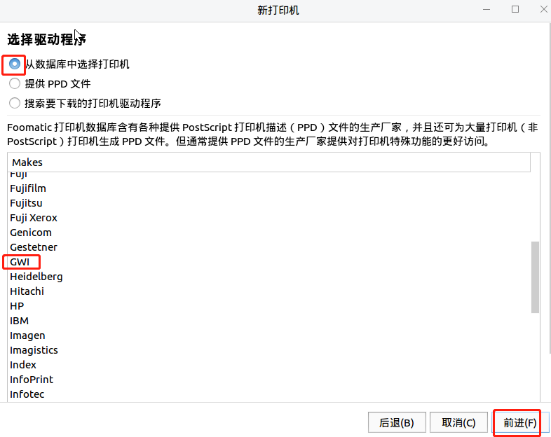
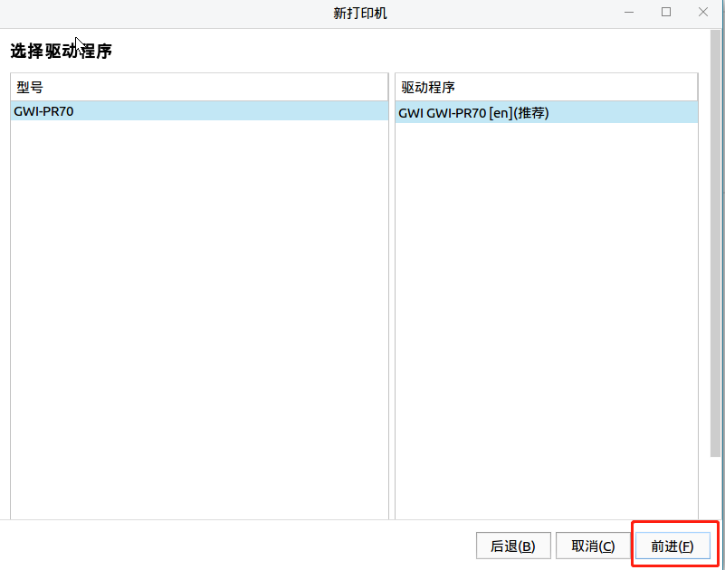
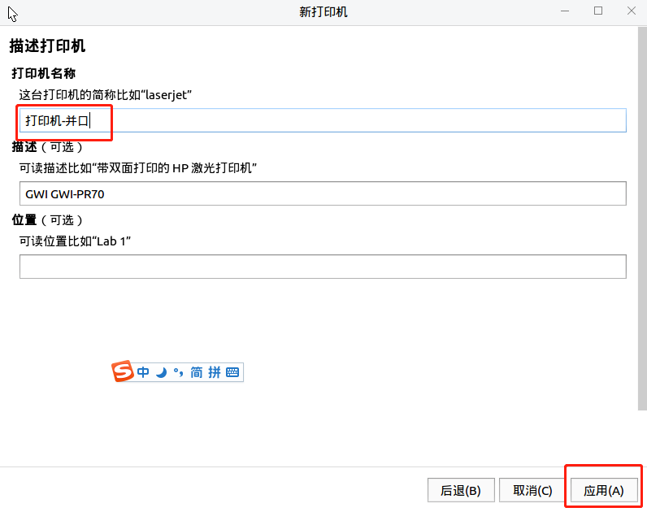
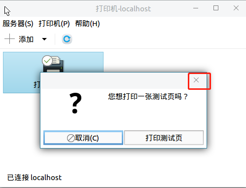
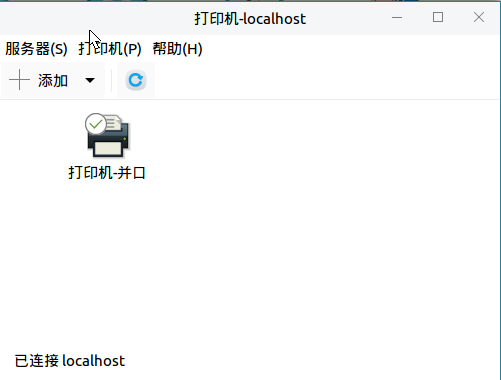

# 添加打印机

## 安装驱动

```bash
./printer_driver_setup.sh
```

## 添加打印机

- 控制面板  
  双击打印机
  

- 添加  
  点击 添加  
  
markd
- 选择打印机
  - 点击 `输入uri`
  - 输入设备URI：  
    输入 `parallel:/dev/usb/lp0`  
    点击 前进

  

- 选择驱动程序  
  - 选择 GWI
  - 点击 前进
  

- 确认
  - 选择 前进
  

- 修改打印机名称
  - 打印机名称改为：`打印机-并口`
  - 点击 应用
  

- 关闭
  - 关闭弹出窗口
  

- 完成
  
