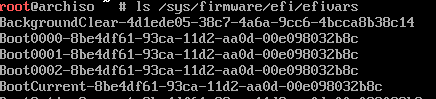
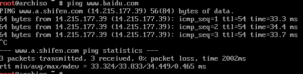
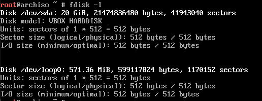
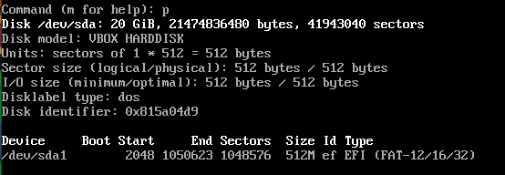
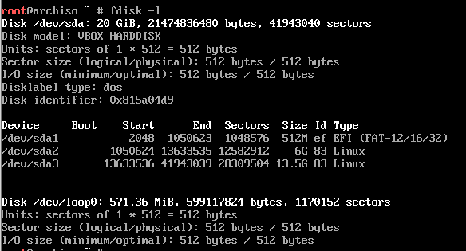
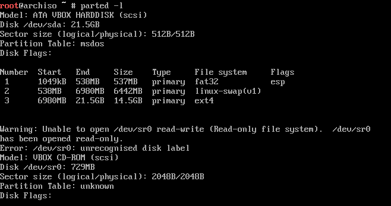
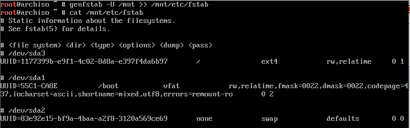
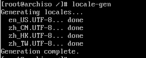
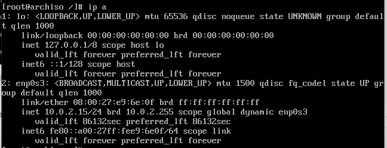
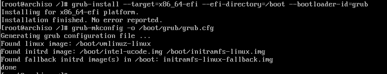

[toc]

# arch linux 安装手记

## 环境

- 虚拟机

  virtual box 5.2.28 r130011 (Qt5.6.2)

- 镜像

  archlinux-2021.02.01-x86_64.iso

## 虚拟机设置

- 硬盘 20G
- 内存 4G
- UEFI 启动

## 安装

### 环境检查

- 检查启动模式

  `ls /sys/firmware/efi/efivars`



UEFI 模式

- 联网检查

  `ping www.baidu.com`

  

### 分区

`fdisk -l`



- EFI 分区

  ``` bash
  fdisk /dev/sda
  n # add a new partition
  p # primary
  1 # partition number
  # enter first sector
  +512M # last sector
  p # print partition table
  t # change a partition type
  ef # efi mode
  w # write table to disk and exit
  ```

  

- root 分区
- swape 分区

整体分区如下



### 格式化

- 格式化引导分区

  ```bash
  mkfs.fat -F32 /dev/sda1
  ```

- 格式化交换分区

  ```bash
  mkswap /dev/sda2
  ```

- 格式化根分区

  ```bash
  mkfs.ext4 /dev/sda3
  ```



### 挂载分区

- 激活swap分区

  ```bash
  swapon /dev/sda2
  ```

- 挂载根分区

  ```bash
  mount /dev/sda3 /mnt
  ```

- 挂载 EFI/GPT 分区

  ```bash
  mkdir /mnt/boot
  mount /dev/sda1 /mnt/boot
  ```

### 更换国内源

```bash
vim /etc/pacman.d/mirrorlist

Server = http://mirrors.tuna.tsinghua.edu.cn/archlinux/$repo/os/$arch
Server = http://mirrors.zju.edu.cn/archlinux/$repo/os/$arch
```

将国内源粘贴到最前面（优先级最高）

实际已经配置中科大的优先级最高，未作修改

### 安装基本包

```bash
pacstrap /mnt base linux linux-firmware
```

### 配置系统

```bash
genfstab -U /mnt >> /mnt/etc/fstab
```

检查



### Chroot

```bash
arch-chroot /mnt
```

### Time zone

```bash
ln -sf /usr/share/zoneinfo/Asia/Shanghai /etc/localtime
hwclock --systohc
```

### 提前安装必须软件包

```bash
pacman -S vim dhcpcd nano
```

### Localization

```bash
vim /etc/locale.gen
```

在文件中找到`zh_CN.UTF-8 UTF-8` `zh_HK.UTF-8 UTF-8` `zh_TW.UTF-8 UTF-8` `en_US.UTF-8 UTF-8`这四行，去掉行首的#号，保存并退出。

```bash
locale-gen
```



打开（不存在时会创建）`/etc/locale.conf`文件

```bash
vim /etc/locale.conf
```

在文件的第一行加入以下内容：

```bash
LANG=en_US.UTF-8
```

### Network configuration

#### 设置主机名

```bash
echo bf > /etc/hostname
```

#### 修改 hosts

```bash
vim /etc/hostname
```

在文件的第一行输入你自己设定的一个 myhostname

```bash
127.0.0.1	localhost
::1		localhost
127.0.1.1	myhostname.localdomain	myhostname
```

#### 配置网络

```bash
ip a
```



网卡名为： **enp0s3**

在网络配置目录中，创建 my_network 文件，拷贝 dhcp 样本文件的设置：

```bash
cp /etc/netctl/examples/ethernet-dhcp /etc/netctl/my_network
```

修改 my_network 文件 Interface 字段，把当前网络接口的名称写入：

```bash
Interface=enp0s3
```

把 my_network 作为默认网络配置:

```bash
netctl enable my_network
```

### Initramfs

```bash
mkinitcpio -P
```

### Root password

```bash
passwd
```

### 安装`Intel-ucode`

```bash
pacman -S intel-ucode
```

### 安装`Bootloader`

- os-prober

  > 首先安装`os-prober`这个包，它可以配合`Grub`检测已经存在的系统，自动设置启动选项。

  ```bash
  pacman -S os-prober
  ```

#### **EFI/GPT引导：**

- 安装`grub`与`efibootmgr`两个包

  ```bash
  pacman -S grub efibootmgr
  ```

- 部署`grub`

  ```bash
  grub-install --target=x86_64-efi --efi-directory=/boot --bootloader-id=grub
  ```

- 生成配置文件

  ```bash
  grub-mkconfig -o /boot/grub/grub.cfg
  ```



## 安装后检查

```bash
vim /boot/grub/grub.cfg
```

查看 menuentry 是否正确

```bash
ls /boot
```

查看是否有`initramfs-linux-fallback.img initramfs-linux.img intel-ucode.img vmlinuz-linux`这几个文件

## 重启

```bash
exit
reboot
```

## 问题解决

重启后，卡在 uefi 界面，无法引导 grub

原因分析：uefi 找不到 grub 启动的 efi 文件

解决：

```bash
FS0:
```

在 uefi shell 下输入 `FS0:` , 找到 `EFI/grub/grubx64.efi` 文件，输入 `grubx64.efi`，手动启动grub后进系统

```bash
 mkdir /boot/EFI/boot
 cp /boot/EFI/grub/grubx64.efi /boot/EFI/boot/bootx64.efi
```

此时，uefi 能找到 `/boot/EFI/boot/bootx64.efi` 并启动。

## 参考

- [以官方Wiki的方式安装ArchLinux](https://www.jianshu.com/p/0a436915a42e?utm_campaign=maleskine&utm_content=note&utm_medium=seo_notes&utm_source=recommendation)
