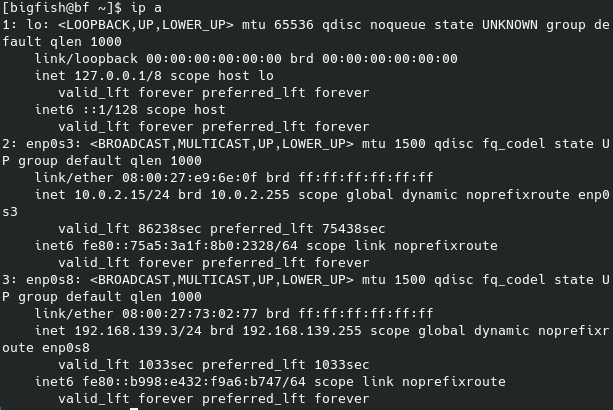
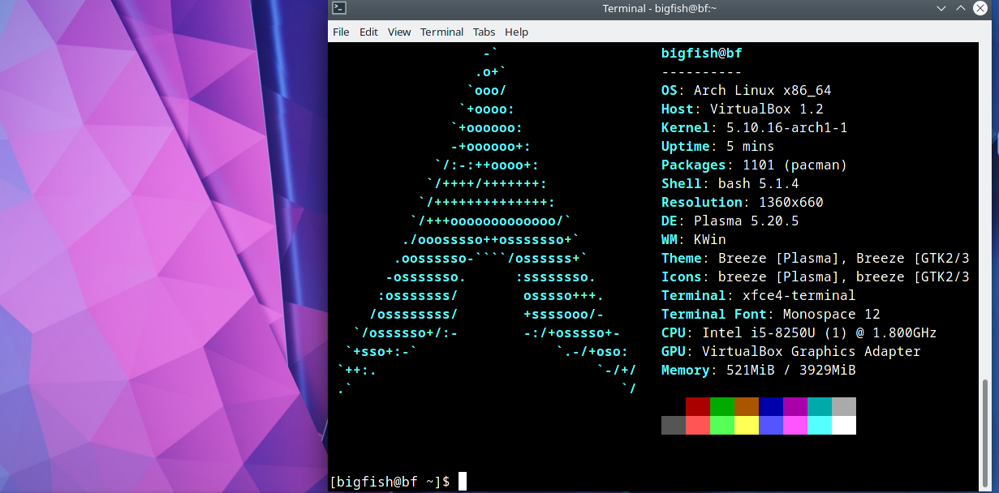

[toc]

# arch linux 配置

### 新建用户

```
useradd -m -G wheel bigfish
```

```bash
passwd bigfish
```

### 配置sudo

```bash
pacman -S sudo
```

用专门的`visudo`命令来编辑`sudo`的配置文件:

```
ln -s /usr/bin/vim /usr/bin/vi
visudo
```

```
%wheel ALL=(ALL)ALL
```

`wheel`组中的所有用户都可以使用`sudo`命令

重启后登录 bigfish 用户，生效

## 图形界面的安装

### 显卡驱动的安装

```
sudo pacman -S xf86-video-vesa
```

### 安装Xorg

```
sudo pacman -S xorg
```

### 安装桌面环境

#### 安装Xfce

```
sudo pacman -S xfce4 xfce4-goodies
```

#### 安装KDE(Plasma)

```bash
sudo pacman -S plasma kde-applications
```

### 安装桌面管理器

#### 安装sddm

```
sudo pacman -S sddm
```

#### 设置开机启动sddm服务

```bash
sudo systemctl enable sddm
```

### 配置网络

#### 安装 networkmanager

```
sudo pacman -S networkmanager
```

#### 启用`NetworkManager`

```
sudo systemctl disable netctl
sudo systemctl enable NetworkManager
```

#### 安装工具栏工具

```
sudo pacman -S network-manager-applet
```

### 安装其它工具

#### 发行版图形工具 neofetch

```
sudo pacman -S neofetch
```

#### 开启 ssh 服务

```
sudo systemctl enable sshd
```

#### 虚拟机新增 host-only 显卡



## 重启进入图形界面




## 参考

- [ArchLinux安装后的必须配置与图形界面安装教程](https://www.viseator.com/2017/05/19/arch_setup/)